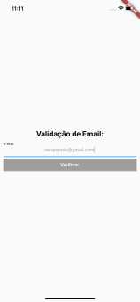

# mobx_example
 Exemplo usando o mobX para gerenciamento de estados na aplicaÇão Flutter.
 
 # Bibliotecas Utilizadas
  - email_validator: ^1.0.4
  - mobx: ^0.4.0+2
  - flutter_mobx: ^0.3.6+1
 
 # Example iOS
 

# App verifica e-mail
 Aplicativo usando o `mobX` mobX para gerenciamento de estados na aplicação Flutter.
 
  ### Projeto desenvolvido ultilizando:
  - [x] Flutter
  - [x] MVU
  - [x] email_validator: ^1.0.4
  - [x] mobx: ^0.4.0+2
  - [x] flutter_mobx: ^0.3.6+1
  
 ## Print Screen :foggy:

|  |
|:---:|
| Validar e-mail | 
